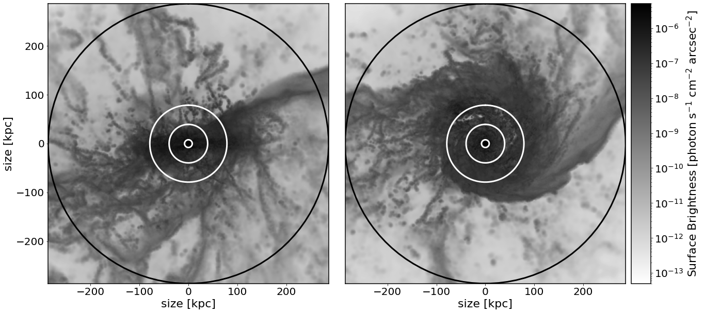
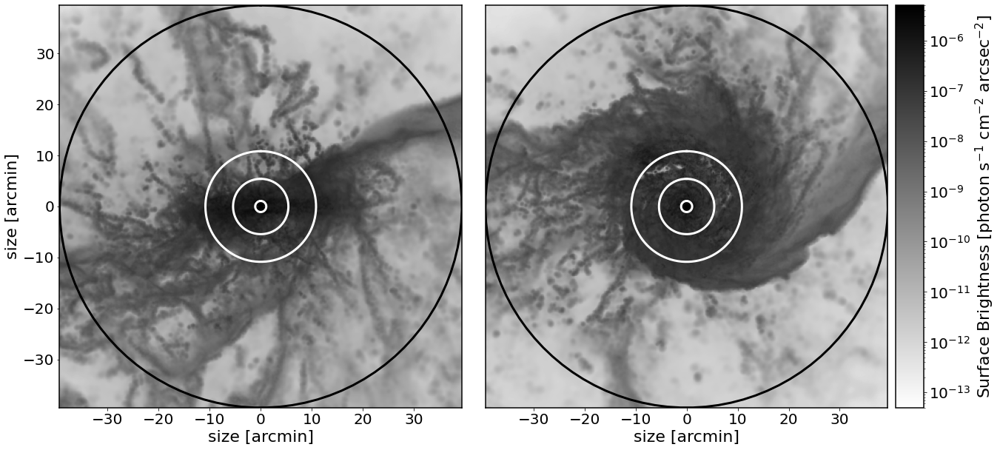
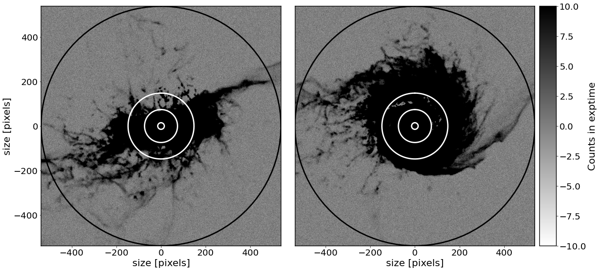
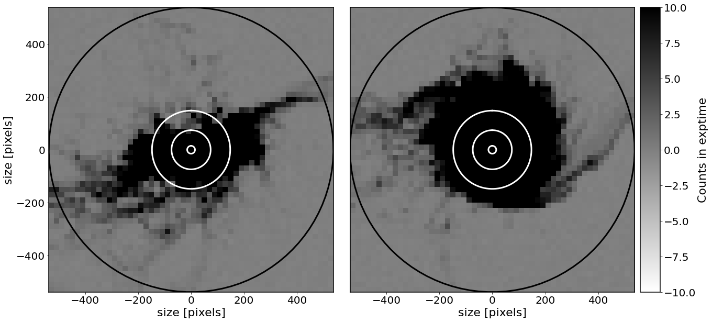

# theia: Simulated Narrowband Observations of Gas Emission

The `theia` package is designed to allow users to visualize "on detector" the line emission from gas in the universe. The primary use case is for narrowband observations of, e.g., H$\alpha$. Support is pending for the insertion of data cubes from IFUs as well (they will be flattened to moment-0 maps). While the code can take in any map in the appropriate units (namely, photon s$^{-1}$ cm$^{-2}$ arcsec$^{-2}$), and has tools to help you convert other maps to these units, it is also designed to easily interface with maps of the CGM around galaxies in TNG50 and FIRE, as discussed in Pasha et al. (in prep). You can download the catalogs of maps separately.  

To install `theia`, you can clone the repository to your local computer:


```python
git clone https://github.com/theia-py/theia.git
```

and then pip install it locally from the folder containing `setup.py`:


```python
pip install .
```

(or, if you plan to make modifications, in development mode):


```python
pip install -e .
```

## Usage 

Under the assumption that you have downloaded the catalogs of maps, we can set up a new map as follows:


```python
from theia import SBMap

g = SBMap()
g.load_TNG50(fof_group=192,
             line='ha', #currently supported are 'ha' and 'nii'
             fof_path='CGM-MAPS_sample_images/',
             cat_path='./sample_props.asdf')
```

In this case, we've loaded `fof_group` 192 from TNG50. To load your own imaging, you can use the following method:


```python
g.add_images(image_face=image1,
             image_edge=image2,
             box_length_kpc=4,
             rvir=None,
             stellar_hmr=None)
```

In the above, two images are supplied --- `theia` is designed to show two orientations naturally (face/edge), but if you supply the same image for both, you'll simply get two noise-added realizations, which can be helpful for deciding when emission is detected or not. You must supply the length of the image in kpc (and the image must be square, at the moment). If you wish, you can add numbers for Rvir and the stellar half mass radius, which are relevant only for plotting circles as shown below but are unnecessary otherwise. 

To see what our galaxy looks like, we can use the `plot_map()` method:


```python
%matplotlib inline
fig, ax = g.plot_map(plot_re_multiples=[5,10],plot_rvir=True)
```





In this example, the `re_multiples` are multiples of the stellar half mass radius from TNG50, and here we've plotted circles at the 1, 5, and 10x this radius. The black circle is the virial radius. 

For convenience, an `on_sky()` method is also provided, which shows the same intrinsic map, but with angular coordinates determined from an input distance:


```python
fig, ax = g.on_sky(distance=25, #Mpc
                   plot_re_multiples=[5,10],
                   plot_rvir=True)
```





As we can see, this galaxy's virial region would subtend almost roughly a degree on sky. 

## Simulating through an Instrument 

Our main goal is to see what this emission would look like when we actually observe it through a telescope. To do this, let's set up our instrument with some properties:


```python
import astropy.units as u
g.setup_instrument(optical_diameter=1, #meter
                  pixel_scale=4.4, #arcsec per pixel
                  source_velocity=1000, #km/s
                  emission_wl=6563, #angstrom
                  read_noise=4.5, #e-
                  efficiency=0.7, #total throughput+quantum efficiency of detector
                  dark_current=0.01, #e/s
                  filter_bandpass=8*u.angstrom) 
```

These are all the parameters that define the system we will be passing our photons through. 

Next, we need to simulate this on the detector, and catagorize the sky we are dealing with:


```python
g.simulate_on_detector(distance=25, #Mpc
                       exptime=3600, #s
                       n_exposures=10, 
                       seeing_fwhm=2.0, #arcsec
                       crop=True,
                       resampling='interp', #or 'adaptive'
                       use_sky_spectrum=True,
                       radii=True)
```

    ['UVES_sky_all/fluxed_sky_860L.fits', 'UVES_sky_all/fluxed_sky_580U.fits']


    100%|██████████| 10/10 [00:01<00:00,  6.30it/s]


There's a few things we've set above. The more obvious is the distance, single-image exposure time (in seconds), and number of exposures (which are averaged). The seeing FHWM is entered in arcseconds. 

The `crop` keyword indicates whether to crop the image down to the virial radius (as the upper maps display). For most cases, we want to use this. However, if you wish to insert the map into a larger image, you can do that by setting `crop=False` and `detector_dims=(1000,1000)` (or whatever you wish). Just be sure, of course, that those dimensions are bigger than the number of pixels the galaxy map already subtends! (You can check this by running cropped first). 

*Note that the random poisson sampling for each image takes progressively longer as you add more pixels to the image.* 

A key parameter determining the final images is the number of photons in each pixel per exposure from the sky. This can thus be input in several ways. If you set `use_sky_spectrum` to `True`, as we have here, then a chunk of the flux-calibrated UVES sky spectrum (equal to your bandpass, at the red/blue shifted wavelength of the emission line given your choice of source velocity) will be integrated. However, you might have better estimates of the sky brightness at your site, at the relevant wavelengths. You can thus also set `use_sky_spectrum=False`, and instead supply `sky_magnitude` or `sky_counts` directly. 

We can now view our galaxy on-detector:


```python
fig, ax = g.visualize_on_detector(plot_re_multiples=[5,10],
                                  plot_rvir=True,
                                  vmin=-10,
                                  vmax=10)
```





You can also add a `binning_factor` to bin the final images:


```python
fig, ax = g.visualize_on_detector(plot_re_multiples=[5,10],
                                  plot_rvir=True,
                                  vmin=-10,
                                  vmax=10,
                                  binning_factor=20)
```





*Note that the images here look particularly nice.... but we're assuming 10 1hr exposures on a 1-meter telescope with a 0.8 nm bandpass, which is wholly unrealistic.*

## Saving Output

You can save to `FITS` format the observed maps as follows:


```python
g.save_fits('test.fits')
```

or, to save the image binned (as shown above), 


```python
g.save_fits('test.fits',binning_factor=10)
```

The images are saved in the 1st and 2nd extension, while the 0th extension's header contains most of the relevant parameters that were used when creating the images. 

## Upcoming features 

`theia` was developed initially to make predictions for the Dragonfly Spectral Line Mapper, which as a lens-based array with specialized coatings has negligible scattered light/reflections. For other systems (such as traditional mirror telescopes), internal reflections are a considerable source of systematics. I'll soon add a feature to allow for arbitrary extra light sources to be added to the calculation. 

For added veracity, I hope to soon add a feature to allow for the simulation of the actual continuum subtraction step. 
